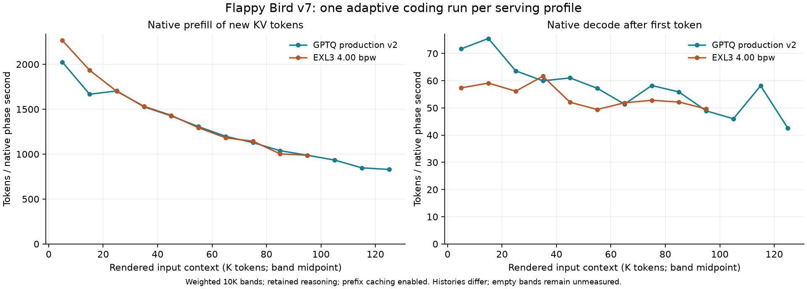

# EXL3 v1 coding benchmark evidence

Measured on the qualified immutable v1 image on 2026-10-02. Adaptive agent
histories differ; rates are not an isolated quantization or engine comparison.

### Short Python fixture

The [QueueKit fixture v2](../benchmarks/coding-fixture/v2/README.md) copies a frozen
Python repository and gives the model two linked editing tasks in one
conversation, with file/test tools and hidden acceptance tests after each
task. This fresh run used fresh workers with the same immutable image/profile as
the source-review run. The [summary](../benchmarks/runs/2026-10-02-exl3-production/summary.json) records fixture and runner
hashes. This is one adaptive session, not a multi-run distribution.

| Coding workload result | Measured value |
|---|---:|
| Tasks / hidden acceptance tests | **1/2 tasks, 7/8 tests passed** |
| End-to-end time | **7 min 36 s** |
| Model requests / tool calls | **29 / 33** |
| Actual input context range | **716–33,967 tokens** |
| Logical prompt / generated tokens | 461,149 / 27,328 |
| Newly computed / prefix-cached prompt tokens | 97,949 / 363,200 |
| Prefix-cache hit rate | **78.8%** |
| Weighted native prefill compute | **1,883.6 tok/s** |
| Weighted native decode after first token | **67.9 tok/s** |
| MTP accepted / drafted tokens | **75.7%** |
| Preemptions | **0** |

The coding rates exclude tool execution; end-to-end time includes it.
Generated tokens include reasoning. Prefix caching remained enabled between
agent turns. Raw generated code and conversation records remain local.

**Functional task failure:** `snapshot-restore-metrics`: `test_roundtrip_and_detachment (test_task2.SnapshotRestoreMetrics.test_roundtrip_and_detachment)`.

The generated output is preserved without repairs or a replacement run. The summary records the failed test output; the [release report](../docs/EXL3_RELEASE_REPORT.md) records the native-attention control and the separate release decision.

### Long WebGL2 coding task

The corrected [Flappy Bird v7 assignment](../benchmarks/web-coding-fixture/v7/README.md)
uses six fixed stages, deterministic physics, procedural WebGL2 graphics,
controls, responsive UI, settings and highscores, without a level editor or
replay system. Both engines use the same task/harness, seeds, sampling,
retained reasoning, 4,096-token thinking budget and 40-minute task budget.
Unmodified final outputs are independently graded against the same 54 cases.

| Result | GPTQ production v2 | Current EXL3 v1 |
|---|---:|---:|
| Wall time / task outcome | 32min 6s; complete | 24min 12s; complete |
| Requests / maximum input context | 77 / 122,078 | 66 / 90,444 |
| Frozen functional checks | 54/54 | 54/54 |
| Native prefill / decode tok/s | 1207.9 / 58.1 | 1388.7 / 53.9 |

[All measured 10K context bands and request accounting](../benchmarks/runs/2026-10-02-flappybird-v7/README.md)
preserve empty bands as unmeasured. Prefill counts new KV tokens; decode counts
post-first generated tokens including reasoning. Agent histories differ, so
overall rates and task duration do not isolate engine or quantization effects.
One seed/pair does not establish a general model-quality ranking. The older
[v6 result](../benchmarks/runs/2026-10-01-flappybird/README.md) remains historical;
it is not substituted for the corrected current run.

